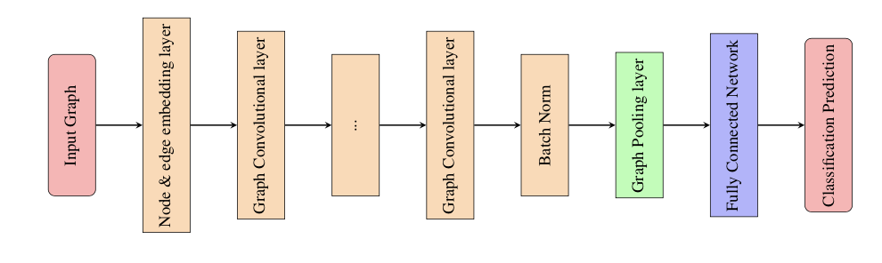
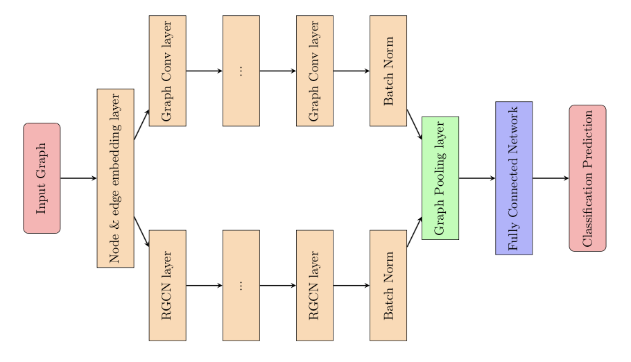

# DL_Project


Our Deep Learning Project uses the ogbg-molhiv dataset from the OGB platform found [here](https://ogb.stanford.edu/docs/graphprop/). It explores and test out graph neural network architectures.


## Environment setup
The main three package used are [OGB](https://github.com/snap-stanford/ogb), [Pytorch Geometric](https://pytorch-geometric.readthedocs.io/en/latest/notes/installation.html) and [Pytorch](https://pytorch.org).

To create a workable virtual environment please run :
```
conda env create --name envname --file=environments.yml
```

## Dataset description 

The ogbg-molhiv dataset has the following characteritics
| #Graphs | #Nodes per graph | #Node features | #Edges per graph | #Edge features | #Positive label |
|---------|------------------|----------------|------------------|----------------|-----------------|
| 41,127  | 25.5             | 9              | 27.5             | 3              | 3.5%            |3              | 3.5%            |

## Repository structure

```
├── README.md
├── environment.yml
├── main.py
├── params.py
└── src
    ├── gnn.py
    ├── rgcn.py
    └── rgcn_gnn_inception.py
```

- ```params.py``` summarizes the hyperparameter used in our two type of models (gnn and rgcn).
- ```gcnn.py```,  ```rgcn.py``` and ```rgcn_gnn_inception.py``` are the instanciated model types.
- ```main.py``` launches model training.


## General model architecture 

Our neural network will be composed of 2 blocks. The first block will learn the graph embedding thanks to specific types of layer e.g. graph convolutional layers. The second is a fully connected network for the classification. The project focuses on the analysis of the performance of the first block and its hyperparameters. Purposely, we won't scrutinize the node \& edge embeddings provided by the OGB python package. 

||
| :--:|
| *Model Architecture* |

||
| :--:|
| *Inception Model Architecture* |

## General use

To tune hyperparameters please change content in ```params.py```. 
To launch training please run : 
```
python main.py
```
No model saving is done in our code.